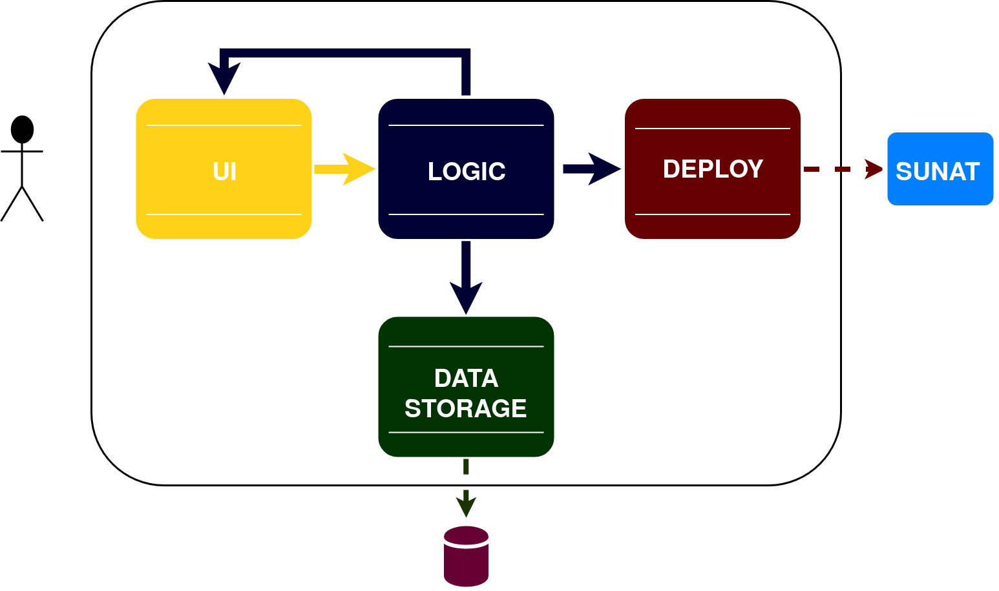

# Introduction

Since the evolution of the internet and the creation of smart phones, mobile applications have become increasingly necessary to facilitate us in our daily lives. In banking issues this facility is not alien, since the way to transfer money has changed radically. One of the applications that most sound and have changed the way we do transactions is Yape, this is an application for smarthphones launched by the BCP that facilitates the transfer of money.
In the course of Software Engineering a professional environment has been recreated with real costumers, in this case Yape is the costumer to whom we have to advise so that the number of users that he has increases rapidly, for which he will have to present an idea for then validate it and, followed by the metrics taught in the course, implement them. In the present report, Yacket will be presented which will add the feature of issuing an electronic invoice to the Yape application, in this way we intend to increase the amount of Yaperos.
For this, two potential costumers have been defined. The first one is the yape costumer that usually goes to mypes and pymes. The second is a possible owner and owner of the mypes and pymes. Both like technology and constantly seek new ways to digitize the entire sales process, taking advantage of these tools that speed up, ensure and facilitate buying and selling.
The purpose of this project will be to implement the functionality of electronic tickets and invoices through Yape.

# Features

## Antonio Toche/Fernando Socualaya/Sergio Carbone: UI design

### Sergio Carbone/Antonio Toche/Fernando Socualaya: Yape UI Login

This section will try to recreate the Yape UI as close as possible, Yape Negocios will be a different application to the already known Yape, but will preserve some of the existing designs.

- v1.1 Add login UI from Yape.
- v1.2 Add DNI Input.

### Fernando Socualaya: Register section UI

In this section the UI will be made for the part of the registry that the owner will have to do. The owner must be registered to be able to access an account and that his collaborators have access.

- v1.1 Add forms.
- v1.2 Add register button.

### Sergio Carbone: Entity picker

In this section you can select if it is a collaborator or an owner. You must enter as a collaborator or owner to upload the information of each company respectively. It was implemented in this way since you can own one company and collaborate with another.

- v1.1 Add button component.
- v1.2 Add pickers.

### Antonio Toche: Owner UI feature.

Similar to collaborator feature the owner can generate charges, and manage session. Here the owner can create and remove a new collaborator, the owner will be able to see the last entry of each one of his collaborators thanks to the section of notifications and also he will be able to see what contributed by each collaborator.

- v1.1 Add picker Ticket/invoice.
- v1.2 Add inputs.
- v1.3 Add pay/get back/ Notifications/ Collaborators/ Movements/ Settings/ Profile/ Log Out buttons.
- v1.4 Add display Qr.

### Fernando Socualaya: Qr code UI feature

Once the items are placed, you will need to generate the Qr code so that the payment can be made effectively. The qr is needed to make the payment effective, this way you avoid having a contact section and the transfer is faster.

- v1.1 Add Qr interface.

## Antonio Toche/Fernando Socualaya/Sergio Carbone/Jose Chavez/ Jeffrey Orihuela: Implementation

### Jeffrey Orihuela/Antonio Toche: Ticket

The ticket generator will be the feature that sends the generated ticket to the respective emails. For this feature, you need the yape owner's email and the customer's email these had to be filled in previously.

- v1.1 Get data.
- v1.2 Send email.
- v1.3 Save ticket.

### Fernando Socualaya/José Chavez: Invoice

The selling generator will be the component that sends the generated selling to the respective emails. For this function, you need the email from the Yape owner and the customer's email, in addition you will need the RUC, adress and business name all these had to be filled in previously.

- v1.1 Get data.
- v1.2 Send data to Sunat.
- v1.3 Send/Save bill to email.

### Sergio Carbone/Jeffrey Orihuela: Qr generator

Once the items are placed, you will need to generate the Qr code so that the payment can be made effectively.

- v1.1 Get/Show data.
- v1.2 Set Qr.

### José Chávez/ Antonio Toche: Implement Database

In order to have something to store the data sent, a database will be necessary. Here you can make querys. The database implmented will be postgresql.

- v1.1 Create entity-relationship model/ relational model/ normalize/ create tables.
- v1.2 Connect database into the backend using an ORM.

# Design

## Architecture

### Class Diagram

 

### Architecture Diagram

### UI
The UI section has been divided into 2 parts which are for the collaborator and the owner, obviously both have much in common. What they share both will be the part of registration and and making tickets and invoices. The difference is when we enter the owner component since it manages the collaborators. That is why owner have notifications, collaborators, movements, adjustments and profile. And the collaborator section can only make tickets and invoices. We have a controller view which will be able to handle each button that redirects us to another page, in addition we have an authentication section that jumps when the login data fails.

### Trigger
The Trigger component will be in charge of sending the voucher information to SUNATs Data Base so the transaction will be legally completed and stored.

 

### Interaction between components

#### Add New Business

#### Generate Voucher

#### Log In as Business

# FAQ

#### **Q:** Is a separate application necessary for the implementation of this feature?

**A:** Yes, due to operating methods and users preferences the best way is to have separate apps

#### **Q:** Is a database manager really needed for this implentation?

**A** A database administrator is crucial to this implementation due to the confidential information and important good management of the data.
# Glossary

    * Yape: name of the application.
    * Yacket: name of the services.
    * MYPE/PYME: Micro and Small sized enterprises.
    * Owner: Micro and Small sized enterprises owner.
    * Micro sized entreprise: Conformed by less than 10 employees.
    * Client: person who use yape to pay.
    * Small sized entreprise: Conformed by less than 20 employess.
    * Collaborator: Employee.
    * Notifications: alert wich triggers when collaborators entry in your business.
    * Movements: charges made by collaborators.
    * Consumer: The person who purchase a product.
    * MYPE/PYME owner: The person who owns/manages a MYPE/PYME.
    * Ticket/invoice/selling: Payment vouchers.
    * Settings: settings of the business or owner.
    * ORM: Object-relational mapping
    * Database: data save.
    * RUC: Unique Taxpayers Registry
    * Querys: data petition.
    * Log out: session ends.
    * Get back: back to the last layout.
    * Layout: view of the app.
    * Inputs: entry of data.
    * Forms: entry of data for registration purposes.
    * SUNAT: Entity that collects taxes.
